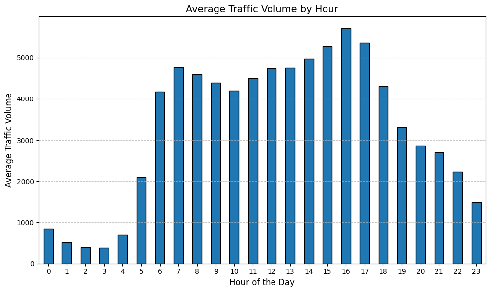
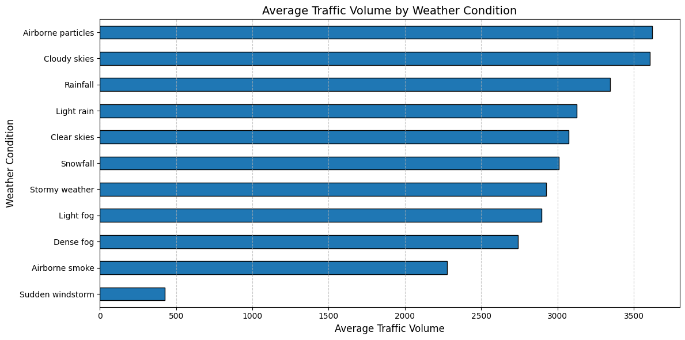
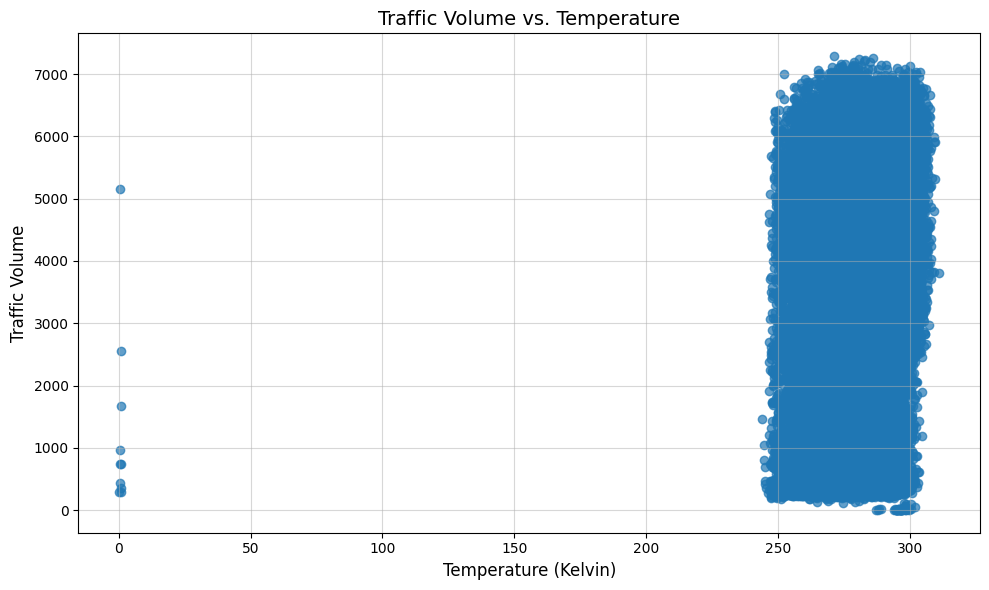
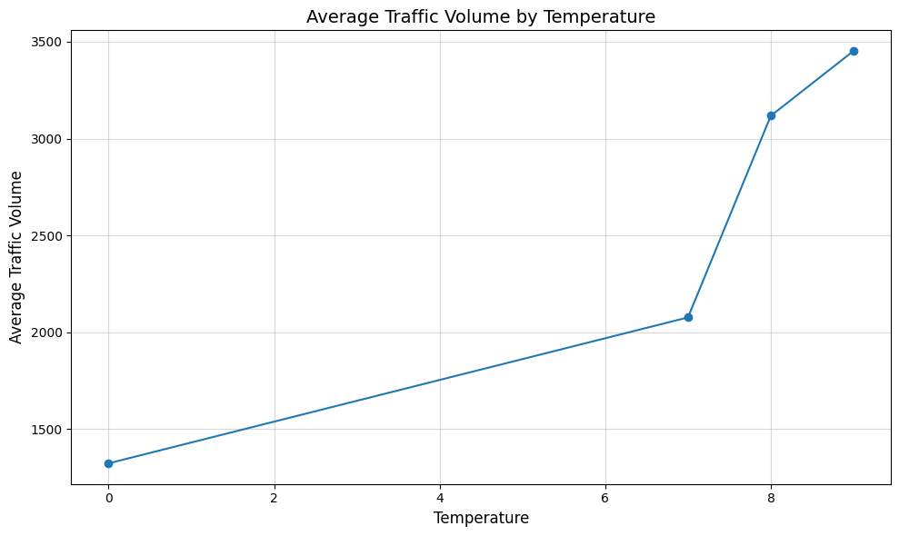
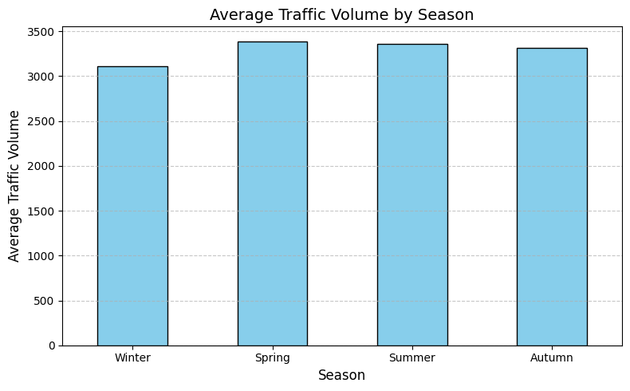

# Weather-Based Traffic Volume Prediction

## Project Overview
This project analyzes the relationship between weather conditions and traffic volume using machine learning. The dataset includes various weather metrics and corresponding traffic measurements.

## Dataset Description
The project uses three main datasets in the Dataset directory:

### Train.csv
Training data containing:
* Holiday indicator
* Temperature
* Rainfall/Snowfall measurements
* Cloud Cover
* Weather conditions and descriptions
* Timestamp information
* Traffic volume

### Test.csv
Test dataset with similar features

### Submission.csv
Template for predictions

## Features
* **Holiday**: Binary indicator for holidays
* **Temperature**: Recorded in Kelvin
* **Rainfall_last_hour**: Precipitation amount
* **Snowfall_last_hour**: Snowfall amount
* **Cloud_Cover**: Percentage of cloud coverage
* **Weather & Weather_Desc**: Weather condition descriptions
* **TimeStamp**: Date and time of recording
* **Traffic_Vol**: Target variable - traffic volume

## Analysis
The `EDA.ipynb` notebook contains:
* Data preprocessing
* Feature engineering
* Label encoding of weather conditions
* Correlation analysis
* Data visualization

## Visualizations
<table>
    <tr>
        <td></td>
        <td></td>
    </tr>
    <tr>
        <td></td>
        <td></td>
    </tr>
    <tr>
        <td></td>
        <td></td>
    </tr>
</table>

## Insights

* **Traffic by Hour and Weather**: Traffic peaks during morning and evening rush hours, with lower volumes late at night. Weather conditions like clear skies see higher traffic volumes compared to rain or snow.
* **Impact of Temperature on Traffic**: Moderate temperatures correlate with higher traffic, while extreme cold or heat leads to reduced traffic volumes.
* **Seasonal Trends**: Traffic is highest during summer, potentially due to increased outdoor activities, and lowest in winter, likely influenced by holidays and adverse weather.
